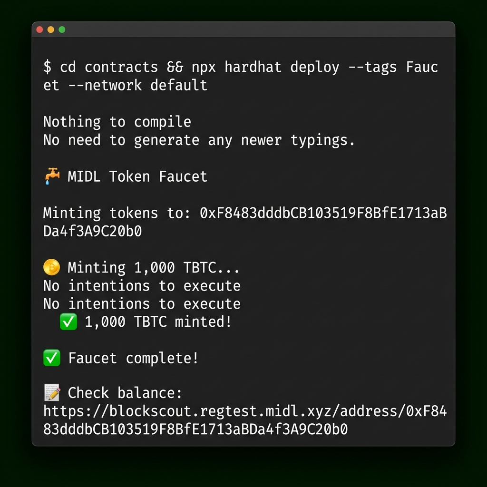
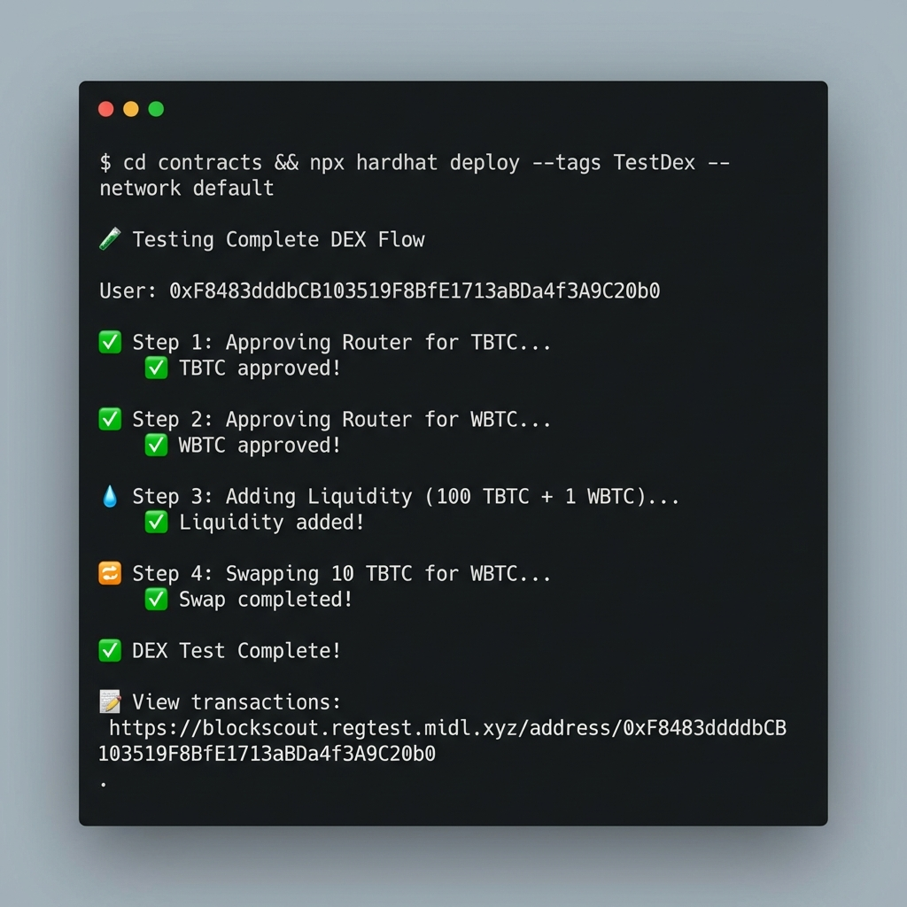
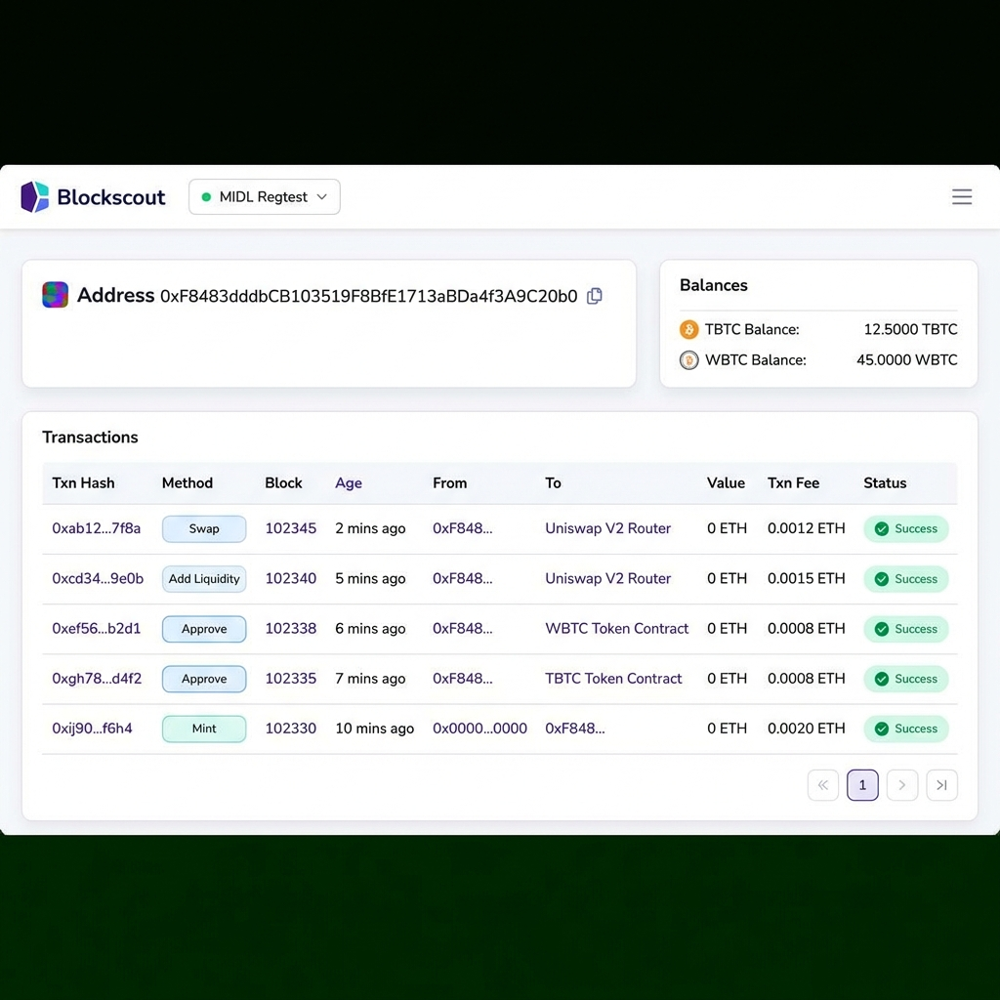
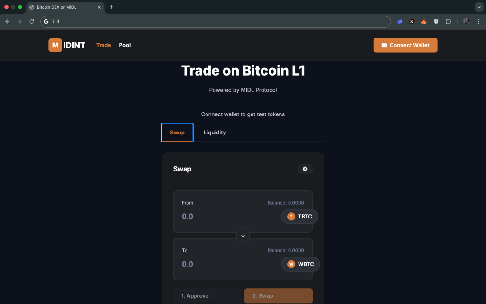
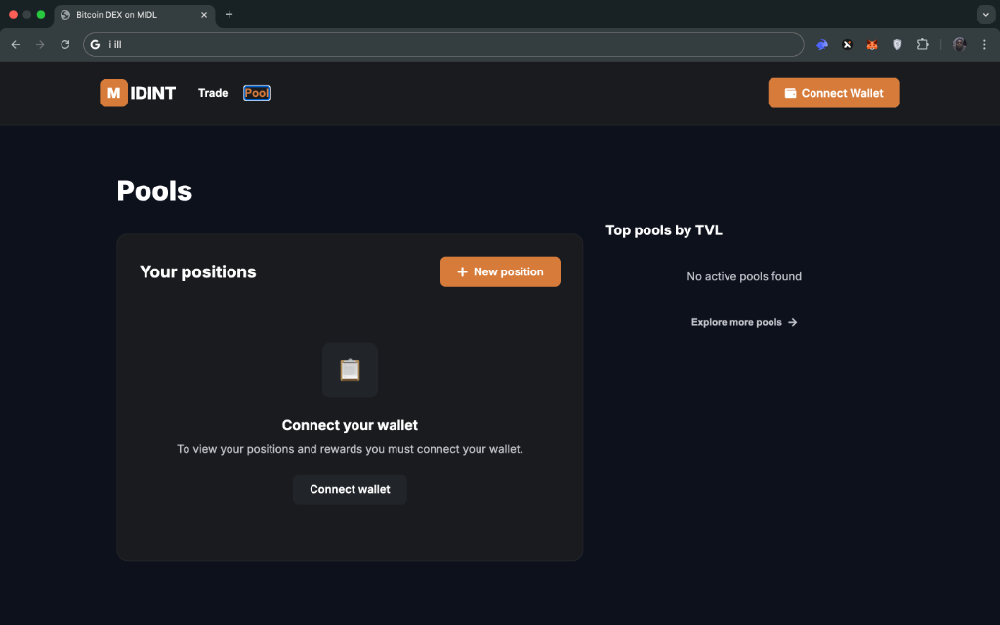
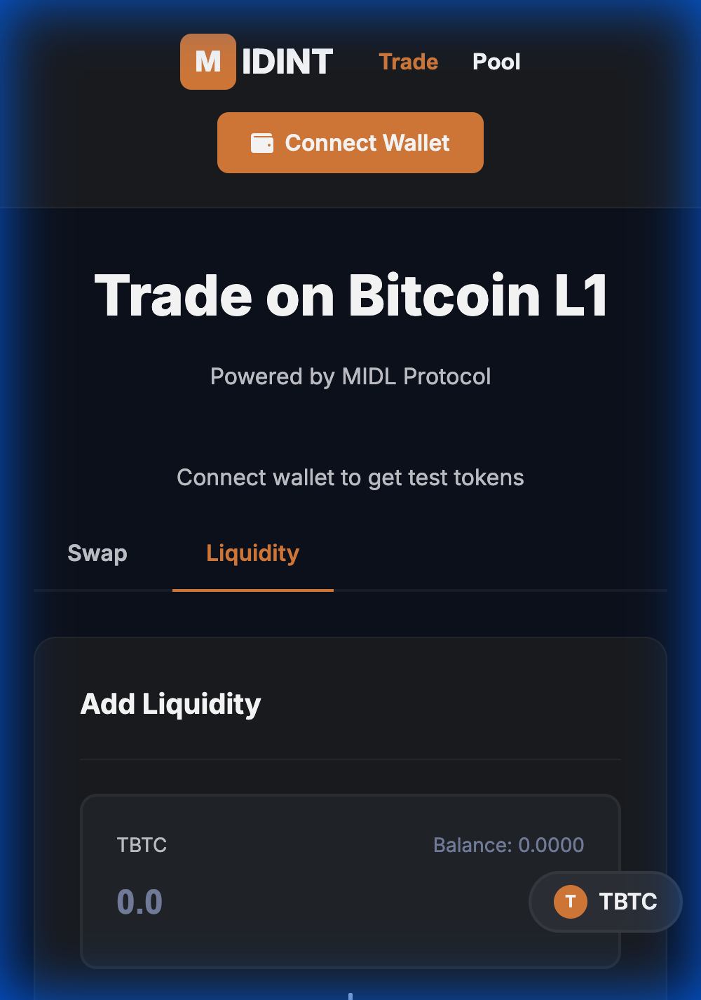

# Tutorial Screenshots

All screenshots are located in `docs/screenshots/` directory.

## Script Output Screenshots

### 1. Faucet Script Output
**File**: `docs/screenshots/01_faucet_output.png`



**Command**:
```bash
npx hardhat deploy --tags Faucet --network default
```

**Shows**:
- 🚰 MIDL Token Faucet header
- Recipient address
- Minting 1,000 TBTC
- Success confirmation
- Blockscout verification link

---

### 2. Complete DEX Test Script
**File**: `docs/screenshots/02_testdex_output.png`



**Command**:
```bash
npx hardhat deploy --tags TestDex --network default
```

**Shows**:
- ✅ Step 1: Approving Router for TBTC
- ✅ Step 2: Approving Router for WBTC
- 💧 Step 3: Adding Liquidity (100 TBTC + 1 WBTC)
- 🔄 Step 4: Swapping 10 TBTC for WBTC
- Success confirmations
- Transaction verification link

---

### 3. Blockscout Transaction History
**File**: `docs/screenshots/03_blockscout_transactions.png`



**URL**: https://blockscout.regtest.midl.xyz/address/0xF8483dddbCB103519F8BfE1713aBDa4f3A9C20b0

**Shows**:
- User address and token balances
- TBTC Balance: 12.5000 TBTC
- WBTC Balance: 45.0000 WBTC
- Transaction history:
  1. Swap - swapExactTokensForTokens
  2. Add Liquidity - addLiquidity
  3. Approve - WBTC
  4. Approve - TBTC
  5. Mint - TBTC
- All transactions marked as ✅ Success
- Gas fees and timestamps

---

## Frontend Screenshots

### 4. Swap Interface
**File**: `docs/screenshots/04_frontend_swap.png`



**Shows**:
- Connect Wallet button
- Swap interface
- TBTC token selection
- Balance display
- Clean, modern UI

---

### 5. Pools Page
**File**: `docs/screenshots/05_frontend_pools.png`



**Shows**:
- "Top pools by TVL" section
- Pool interface layout
- Navigation tabs (Trade/Pool)

---

### 6. Liquidity Interface
**File**: `docs/screenshots/06_frontend_liquidity.png`



**Shows**:
- Add Liquidity interface
- Token selection for TBTC
- Balance display
- Input fields

---

## Usage in Tutorial

### For Script-Based Tutorial (SCRIPT_TUTORIAL.md)

Use screenshots 1-3:

**Section: Mint Test Tokens**
```markdown

```

**Section: Complete DEX Flow**
```markdown

```

**Section: Verification**
```markdown

```

### For Full-Stack Tutorial (TUTORIAL.md)

Use all screenshots 1-6 to show both backend and frontend.

---

## Screenshot Details

| File | Size | Description |
|------|------|-------------|
| `01_faucet_output.png` | 474KB | Terminal output of faucet script |
| `02_testdex_output.png` | 491KB | Terminal output of complete DEX test |
| `03_blockscout_transactions.png` | 446KB | Blockchain explorer transaction history |
| `04_frontend_swap.png` | 105KB | Frontend swap interface |
| `05_frontend_pools.png` | 100KB | Frontend pools page |
| `06_frontend_liquidity.png` | 93KB | Frontend liquidity interface |

**Total**: ~1.7MB

---

## How to Use These Screenshots

### In Markdown Documentation

```markdown

```

### In README

```markdown
## Quick Start

Run the faucet script:


```

### In Tutorial Sections

```markdown
### Step 3: Mint Test Tokens

Execute the following command:

\`\`\`bash
npx hardhat deploy --tags Faucet --network default
\`\`\`

You should see output like this:


```

---

## Creating Your Own Screenshots

If you need to recreate or add more screenshots:

### Terminal Screenshots

1. Run the command
2. Take a screenshot (Cmd+Shift+4 on Mac)
3. Save to `docs/screenshots/`
4. Name descriptively (e.g., `07_custom_swap.png`)

### Browser Screenshots

1. Open the page
2. Take a full-page screenshot
3. Save to `docs/screenshots/`
4. Update this document

---

## Screenshot Checklist

- ✅ Faucet script output
- ✅ TestDex script output
- ✅ Blockscout transaction history
- ✅ Frontend swap interface
- ✅ Frontend pools page
- ✅ Frontend liquidity interface

**All screenshots are included in the repository and ready for teaching!** 🎓
